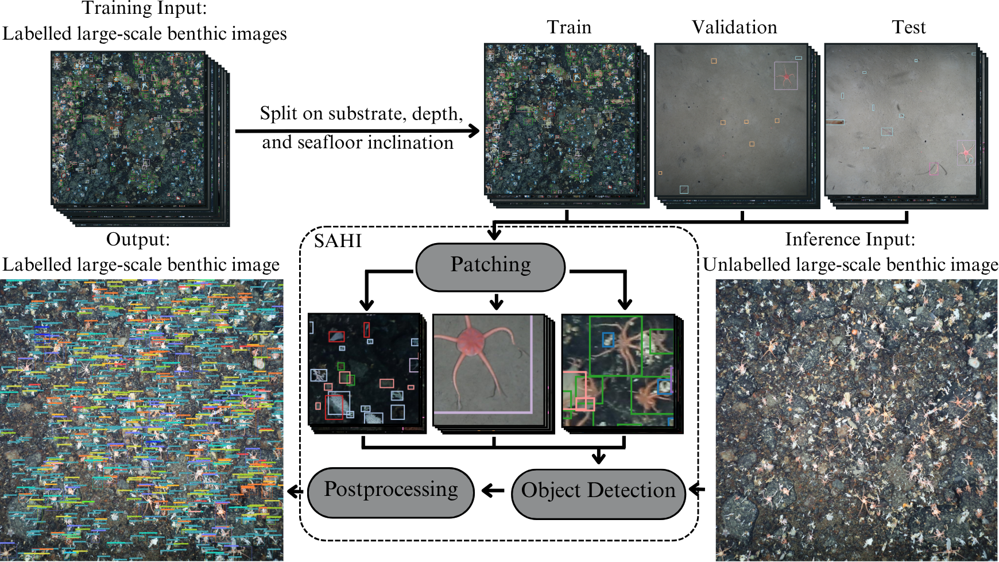

# Automated Detection of Antarctic Benthic Organisms in High-Resolution In Situ Imagery to Aid Biodiversity Monitoring

<!-- markdownlint-disable MD033 -->
<div align="center">

Integrating MMDetection and SAHI to detect Antarctic Benthic Organisms



</div>
<!-- markdownlint-enable MD033 -->

## 📑 Overview

This repository contains the code for _Automated Detection of Antarctic Benthic Organisms in High-Resolution In Situ Imagery to Aid Biodiversity Monitoring_ (Trotter et. al, 2025) [TODO: Add link to paper when available].

The code is based on the [MMDetection](https://github.com/open-mmlab/mmdetection) framework and uses the [Slicing Aided Hyper Inference (SAHI)](https://github.com/obss/sahi) library. Whilst MMDetection has some integration with SAHI out of the box, this repo provides further integration, namely **the ability to evaluate an MMDetection model with and without SAHI post-processing**.

We also provide **a full training and evaluation pipeline for MMDetection models with SAHI post-processing**, for use with SLURM clusters.

## 📦 Installation

There are two ways to install this repository: using Git or downloading it as a ZIP file. The recommended method is to use Git. Both options allow you to make use of the `setup.sh` script. This will:

- Install the required dependencies through a mamba environment.
- Clone and install the MMDetection repository.
- Merge the required additional files created for this project into MMDetection (see `./mmdetection_additions`).
- Download the Weddell Sea Bethic Dataset.
- Download the optimal model weights for the Weddell Sea Benthic Dataset. [TODO: Add in when available on PDC]
- Download the required model weights from the MMDetection model zoo.

An output log, `setup_output.txt`, will be created in the root directory of the repository. This log contains the output of the setup script, including any errors that may have occurred during installation.

### Option 1: Using Git (Recommended)

1. Clone the repository:

   ```bash
   git clone https://github.com/Trotts/antarctic-benthic-organism-detection.git
   cd antarctic-benthic-organism-detection
   ```

2. Run the setup script:

   ```bash
   ./setup.sh
   ```

### Option 2: Downloading as a ZIP file

1. Download the repository as a ZIP file from this repo's GitHub page using the green "Code" button  at the top of the webpage and selecting "Download ZIP".

   Alternatively, you can download it directly using the command line:

   ```bash
   wget https://github.com/Trotts/antarctic-benthic-organism-detection/archive/refs/heads/main.zip
   ```

2. Extract the ZIP file:

   ```bash
   unzip antarctic-benthic-organism-detection.zip
   cd antarctic-benthic-organism-detection
   ```

3. Run the setup script:

   ```bash
   ./setup.sh
   ```

## 📊 Usage

The below instructions assume you are using a SLURM cluster. If you are not using SLURM, you can run the scripts called within the `.sh` files directly in your terminal.

## ⚡ Inference

To run inference using the optimal model trained on the Weddell Sea Benthic Dataset:

1. Edit the `mmdetection/tools/slurm_best_inference.sh` file to set the correct sbatch instructions and paths for your environment (lines 7-24).

2. Submit the job to SLURM:

```bash
sbatch ./mmdetection/tools/slurm_best_inference.sh
```

## 🏋️ Training

To run a full training and evaluation pipeline using the Weddell Sea Benthic Dataset:

1. Edit the `mmdetection/tools/slurm_pipeline.sh` file to set the correct sbatch instructions and paths for your environment (lines 8-23).

2. Set the parameters you wish use for training in the `mmdetection/tools/slurm_pipeline.sh` file (lines 34-48).

3. Edit `mmdetection/tools/build_config.py` to set the path for the project root (line 15).

4. Submit the job to SLURM:

```bash
sbatch ./mmdetection/tools/slurm_pipeline.sh
```

### 🐙 Training on your own dataset

To make use of your own image dataset, ensure this is provided in COCO format, split into train, validation, and test sets. Follow the formatting of the downloaded Weddell Sea Benthic Dataset as a guide.

If you wish to order your confusion matrix by organism abundance, generate an associated abundance ordering `.pkl` file. This file should contain key-value pairs, where the key is the organism name and the value is its abundance ordering for your dataset. For example, the generated ordering for the WSBD, `abundance_ordering/abundance_ordering.pkl`, is:

```python
{
   'stylasterids': 0,
   'cup_coral': 1,
   'ophiosabine': 2,
   'glass_sponge': 3,
   'ophiuroid_5_arms': 4,
   'demosponges': 5,
   'gorgonian': 6,
   'astrochlamys': 7,
   'crustaceans': 8,
   'alcyonium': 9,
   'cucumber': 10,
   'asteroidea': 11,
   'benthic_fish': 12,
   'pencil_urchin': 13,
   'anthomastus': 14,
   'actiniarian': 15,
   'ascidian_pyura_bouvetensis': 16,
   'ascidian_distaplia': 17,
   'hydroid_solitary': 18,
   'worm_tubes': 19,
   'crinoid': 20,
   'pycnogonid': 21,
   'bryozoan': 22,
   'echinoid': 23,
   'ascidian_cnemidocarpa_verrucosa': 24
}
```

Where `stylasterids` is the most abundant organism in the dataset, and `ascidian_cnemidocarpa_verrucosa` is the least abundant.

You can then use the `mmdetection/tools/slurm_pipeline.sh` script to generate a patched dataset and model config file required for training and evaluation. The resulting model weights can be used for inference with `mmdetection/tools/slurm_best_inference.sh`.

## 🖥️ Compute and Storage Requirements

The following compute and storage resources are recommended:

- **Compute**: 1 x NVIDIA A100 GPU, ideally accessed via a SLURM cluster. The training and inference scripts are designed to run on a SLURM cluster, but can be adapted for local use.
- **Storage**: At least 3 GB of free disk space for the WSBD, model weights, and code base. Additional space may be required for model outputs and training datasets, depending if you change the patch dataset parameters and/or use your own dataset.

## 📂 Data Access

Both the Weddell Sea Benthic Dataset and the optimal model weights are available for download independant of the `setup.sh` script via the NERC Polar Data Centre.

The Weddell Sea Benthic Dataset:

Trotter, C., Griffiths, H.J., Khan, T.M., Purser, A., & Whittle, R.J. (2025). The Weddell Sea Benthic Dataset: A computer vision-ready object detection dataset for in situ benthic biodiversity monitoring model development (Version 1.0) [Data set]. NERC EDS UK Polar Data Centre. <https://doi.org/10.5285/1ba97e4b-efb7-460b-9f2d-90437e33ce09>

The optimal model weights:

Trotter, C., Griffiths, H. J., Khan, T. M., & Whittle, R. J. (2025). Automated detection of Antarctic benthic organisms in high-resolution in situ imagery to aid biodiversity monitoring: optimal model weights (Version 1.0) [Data set]. NERC EDS UK Polar Data Centre. <https://doi.org/10.5285/B2874F3F-285D-4AE6-9BB4-6BFE3EACBFFF>

## 📝 Citations

If you use this code, the Weddell Sea Benthic Dataset, or the best model weights in your own research, please cite the following paper:

```bibtex
[TODO: Add bibtex citation when available]
```
